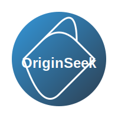

# OriginSeek 网站

<div align="center">
  
  <h3>探索技术本源，提升认知格局</h3>
  <p>
    <a href="https://github.com/originseek/originseek-website/stargazers"></a>
    <a href="https://github.com/originseek/originseek-website/network"></a>
    <a href="https://github.com/originseek/originseek-website/issues"></a>
    <a href="https://github.com/originseek/originseek-website/blob/main/LICENSE"></a>
  </p>
</div>

## 📖 项目简介

OriginSeek 是一个专注于技术探索与实践的知识分享平台，旨在帮助开发者深入理解技术本质，构建系统化的技术认知。网站涵盖 Java 技术栈、AI 框架、技术书籍推荐以及实用开发工具等多个领域的内容。

### ✨ 主要特点

- **技术本质探索**：深入底层原理与设计思想，探寻技术演进本源，建立系统化的技术认知
- **源码深度剖析**：剖析主流框架核心机制，理解设计精髓，掌握技术实现真谛
- **技术认知提升**：梳理技术发展脉络，把握技术演进方向，构建完整的技术知识体系
- **技术分享交流**：分享学习心得与实践经验，碰撞思维火花，共同探讨技术成长之路

## 🔍 内容板块

### 🍵 Java 技术栈

提供全面的 Java 编程知识，包括语言基础、面向对象编程、集合框架、多线程编程、IO操作、网络编程、反射机制等基础知识，以及Spring Framework、Spring Boot、Spring Cloud、MyBatis等主流框架的使用和原理剖析，帮助开发者构建扎实的 Java 技术体系。

### 🤖 AI 框架

介绍多个主流的 Java AI 框架，包括 Spring AI、Spring AI Alibaba、LangChain4j、Jlama、Deepseek4j、Deeplearning4j、Neuroph、Weka、Encog、Mallet、Agent-Flex和JavaML等，这些框架各具特色，能够帮助开发者快速构建AI应用。

### 📚 阅读书单

精选技术类书籍推荐，涵盖《深入理解Java虚拟机》、《代码整洁之道》、《设计模式》、《重构》、《Effective Java》、《Spring实战》、《Java并发编程实战》等经典著作，助力开发者拓宽技术视野。

### 🛠️ 常用工具

收集实用的在线工具，包括API测试工具（如Postman）、代码检查工具（如JSON格式化、正则表达式测试、代码格式化工具）、代码相关工具、格式转换工具、数据处理工具、设计相关工具、编辑器工具、图像处理工具、网络工具、办公工具、性能分析工具和安全相关工具等多种开发辅助工具，提高开发效率。

## 🔧 技术栈

本项目基于以下技术栈构建：

- **框架**：[VuePress 2.0](https://v2.vuepress.vuejs.org/zh/) - 基于 Vue 的静态网站生成器
- **主题**：[VuePress Theme Hope](https://theme-hope.vuejs.press/zh/) - 功能强大的 VuePress 主题
- **包管理器**：[pnpm](https://pnpm.io/zh/) - 快速、节省磁盘空间的包管理器
- **构建工具**：[@vuepress/bundler-vite](https://v2.vuepress.vuejs.org/zh/reference/bundler/vite.html) - 基于 Vite 的 VuePress 打包工具
- **搜索插件**：[@vuepress/plugin-search](https://v2.vuepress.vuejs.org/zh/reference/plugin/search.html) - VuePress 官方搜索插件

## 📂 项目结构

```
.
├── docs                    # 文档目录
│   ├── .vuepress          # VuePress 配置目录
│   │   ├── config.js      # VuePress 配置文件
│   │   ├── public         # 静态资源目录
│   │   └── styles         # 样式目录
│   ├── README.md          # 首页
│   ├── about              # 关于作者
│   ├── ai                 # AI 框架相关内容
│   │   ├── agent-flex     # Agent Flex 框架
│   │   ├── deeplearning4j # Deeplearning4j 框架
│   │   ├── deepseek4j     # DeepSeek4j 框架
│   │   ├── encog          # Encog 神经网络框架
│   │   ├── javaml         # Java 机器学习库
│   │   ├── jlama          # JLama 框架
│   │   ├── langchain4j    # LangChain4j 框架
│   │   ├── mallet         # MALLET 自然语言处理工具包
│   │   ├── neuroph        # Neuroph 神经网络框架
│   │   ├── spring-ai      # Spring AI 框架
│   │   ├── spring-ai-alibaba # Spring AI 阿里巴巴集成
│   │   └── weka           # Weka 机器学习工具包
│   ├── blog               # 博客文章
│   │   ├── 2024           # 2024年文章
│   │   └── 2025           # 2025年文章
│   ├── books              # 阅读书单
│   │   └── tech           # 技术类书籍
│   ├── copyright          # 版权说明
│   ├── java               # Java 相关内容
│   ├── plugins            # 插件相关内容
│   ├── privacy            # 隐私政策
│   ├── terms              # 服务条款
│   └── tools              # 常用工具
│       ├── api            # API 测试工具
│       ├── check          # 代码检查工具
│       ├── code           # 代码相关工具
│       ├── convert        # 格式转换工具
│       ├── data           # 数据处理工具
│       ├── design         # 设计相关工具
│       ├── editor         # 编辑器工具
│       ├── image          # 图像处理工具
│       ├── network        # 网络工具
│       ├── office         # 办公工具
│       ├── performance    # 性能分析工具
│       └── security       # 安全相关工具
├── deploy.sh              # 部署脚本
├── package.json           # 项目依赖配置
├── pnpm-lock.yaml         # pnpm 依赖锁定文件
├── CNAME                  # 自定义域名配置
├── .gitignore             # Git 忽略文件配置
└── README.md              # 项目说明文档
```

## 🚀 本地开发

### 环境要求

- Node.js 16.0 或更高版本
- pnpm 10.0 或更高版本

### 安装依赖

```bash
pnpm install
```

### 启动开发服务器

```bash
pnpm docs:dev
```

启动后，访问 http://localhost:8080 即可查看网站。

### 构建静态文件

```bash
pnpm docs:build
```

构建后的文件位于 `docs/.vuepress/dist` 目录。

## 🌐 部署

本项目使用 GitHub Pages 进行部署，执行以下命令即可完成部署：

```bash
./deploy.sh
```

该脚本会自动构建项目并将生成的静态文件推送到 GitHub 仓库的 main 分支。

## 🤝 贡献指南

1. Fork 本仓库
2. 创建您的特性分支 (`git checkout -b feature/amazing-feature`)
3. 提交您的更改 (`git commit -m 'Add some amazing feature'`)
4. 推送到分支 (`git push origin feature/amazing-feature`)
5. 打开一个 Pull Request

## 📄 许可证

本项目采用 MIT 许可证 - 详情请参阅 [LICENSE](LICENSE) 文件

## 📮 联系方式

如有任何问题或建议，欢迎通过以下方式联系：

- 提交 [Issue](https://github.com/originseek/originseek-website/issues)
- 发送邮件至 [service@originseek.com](mailto:service@originseek.com)

---

<div align="center">
  <p>© 2025 OriginSeek. 保留所有权利。</p>
  <p>用 ❤️ 制作</p>
</div>